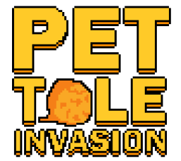

## [**PLAY GAME**](https://kutt.it/pettolegame)

# 

Gioco ufficiale di degustazione di pettole nel borgo antico di Taranto Vecchia.

## Come si gioca

Cercare di degustare "al volo" il maggior numero di pettole possibile, senza prendere le bombe.

***

&copy; 2020 Giuseppe Rossi

Musica: **Kevin MacLeod - Itty Bitty**

***

## Ambiente di sviluppo

Nella cartella *./src_game* è contenuto il progetto GDevelop. Va esportato nella cartella *./resources/game*. 

Nella cartella *./src_js* sono contenuti i sorgenti non minimizzati. I corrispettivi, ottimizzati con [Google Closure Compiler](https://closure-compiler.appspot.com/home), si trovano in *./resources/js*.

Il file *./server_script.js* contiene il codice per la gestione lato server della classifica. Il tutto è gestito tramite [Google Apps Script](https://script.google.com/home/start) e l'etensione per i fogli di calcolo (per la memorizzazione).

